```{r setup, include=FALSE}
knitr::opts_chunk$set(warning = FALSE, 
                      message = FALSE, 
                      comment=FALSE)
```

```{r ,echo=FALSE}
library(tidyverse)
library(lubridate)
```


class: center

```{r xaringan-themer, include=FALSE, warning=FALSE}
library(xaringanthemer)
#style_mono_light(base_color = "#23395b")
#style_duo_accent(primary_color = "#FFFFFF", secondary_color = "#FA795E")
style_duo_accent(primary_color = "#FA795E",
                 secondary_color = "#FFFFFF",
                 header_h1_font_size = "1.8rem",
                 header_h2_font_size = "1.5rem",
                 header_h3_font_size = "1.0rem"
                 )
#style_duo_accent_inverse(primary_color = "#FFFFFF", secondary_color = "#FA795E")
#style_duo_accent_inverse(primary_color = "#FA795E", secondary_color = "#FFFFFF")
```


```{r, echo=FALSE}

```

<br>
<br>
<br>
<br>

```{r, echo=FALSE}
 
```

<br>
<br>

#### 2021-06-28
---
class: center

```{r, echo=FALSE}

```

<br>
<br>
<br>

# Predicción de ocurrencia de delitos. Implementación de modelos predictivos en base a los casos registrados en CABA durante el periodo 2017-2019

<br>

#### Rafael Zambrano

---
# Resumen

🔸 El presente trabajo tiene como objetivo implementar modelos predictivos de aprendizaje automático, que permita **relacionar una esquina o intersección de calles y un momento determinado con la ocurrencia de delitos**, con base en los casos registrados entre los años 2017 y 2019 en la Ciudad Autónoma de Buenos Aires (CABA). 

🔸 El foco principal de la investigación, reside en contextualizar la problemática de la criminalidad dentro de la gestión de datos de las organizaciones. Agregando ademas, elementos que se consideren importantes **en el momento y entorno de la ocurrencia del delito**.


---

# Problemática

🔸 La ocurrencia de delitos es un fenomeno de índole social y económico, dado lo amplio y transversal que resulta estudiar este tópico, se pretende abordar el tema mediante una relación funcional entre la problemática y **la dualidad “entorno-tiempo”**. 

<br>
<br>

--

```{r, echo=FALSE, out.width='80%',fig.align='center'}

```

---

# Problemática

🔸 Se busca implementar modelos de aprendizaje automático que permitan predecir la ocurrencia de delitos en un conjunto de esquinas de CABA, en función de elementos meteorológicos y del entorno cercano a la ocurrencia del crimen.

--

🔸 ¿Cómo puede relacionarse el entorno geográfico, elementos meteorologicos y la ocurrencia delictiva, para brindar herramientas que complementen la ejecución de políticas públicas de seguridad?

<br>

```{r, echo=FALSE, out.width='80%', fig.align='center'}

```

---

# Problemática

* **Consideraciones** 🔎

🔸 Se sostiene que mediante la implementación de un modelo predictivo de aprendizaje automático, es factible relacionar el factor “entorno-tiempo” con la ocurrencia de delitos.

--

🔸 Se afirma que para el histórico de delitos ocurridos, la adición de los elementos de entorno y meteorológicos **contribuirán positivamente en la generación de mejores predicciones**. 

--

🔸 Se asume que la ocurrencia de delitos **se distribuye geográficamente de manera heterogénea en CABA**, además se afirma que los delitos siguen patrones estacionales según los meses del año.

--

🔸 Se asume que el registro de delitos (los datos utilizados) es equivalente a los delitos ocurridos. Factor que puede no cumplirse en muchas situaciones, especialmente en las zonas más peligrosas, **donde el incentivo por denunciar el crimen es mucho menor**.

---

# Contexto Organizacional 🏢

🔸 Este proyecto toma una hipotética institución pública del estado argentino, específicamente **La Policía de la Ciudad Autónoma de Buenos Aires**, esta es la encargada de operacionalizar las políticas públicas de seguridad.

🔸 La propuesta para abordar la problemática no pretende mostrar una solución comercial, se propone la implementación de un estudio que ayude a los tomadores de decisiones, con el propósito de aplicar **políticas de seguridad más eficientes basadas en datos**.

🔸 La construcción de herramientas que ayuden a maximizar la eficiencia de los operativos de seguridad, puede traer beneficios transversales a toda la sociedad, **repercutiendo principalmente en la disminución de la ocurrencia del delito**.

---

# Transformación y limpieza de datos

* **Fuente de datos**

🔸 El repositorio del Gobierno de la Ciudad Autónoma de Buenos Aires (GCABA), es la principal y única fuente de datos, desde este lugar se extraen los datos referentes a delitos ocurridos, factores meteorológicos y elementos físicos del entorno cercano. [Repositorio del GCABA](https://data.buenosaires.gob.ar/dataset/).

--

* **Principales componentes de los datos**

🔸 Los datos tienen dos componentes fundamentales, el primero hace referencia a la geolocalización, siendo representado por la longitud y latitud en cada conjunto de datos. 

🔸 El segundo componente es el tiempo, que está presente en los delitos ocurridos y en los factores meteorológicos. 

🔸 Finalmente se analizan más de treinta conjuntos de datos, almacenados como archivos planos y objetos geoespaciales, posteriormente se integran y transforman para obtener el dataset definitivo.

---

# Transformación y limpieza de datos

* **Evolución de los delitos registrados (2018-2019)**

```{r xaringanExtra-freezeframe, echo=FALSE}
xaringanExtra::use_freezeframe()
```

```{r ,echo=FALSE,  out.width='50%', fig.align='center'}
library(echarts4r)
delitos <- readRDS("delitos.rds")

delitos %>% 
  dplyr::count(fecha) %>% 
  filter(year(fecha) != 2017) %>% 
  dplyr::mutate(year = format(fecha, "%Y")) %>% 
  group_by(year) %>% 
  e_charts(fecha) %>% 
  e_calendar(range = "2018") %>% 
  e_calendar(range = "2019",top="350") %>% 
  e_heatmap(n, coord_system = "calendar") %>% 
  e_visual_map(max = 470, min = 130, bottom = 140) %>% 
  e_title("Calendario de delitos: Mes /Día de la semana", "Número de delitos ocurridos") %>% 
  e_tooltip("item") 
```

---

# Transformación y limpieza de datos

* **Distribución geográfica de los delitos registrados**

<br>

```{r, echo=FALSE,  out.width='50%', fig.align='center',eval=FALSE}
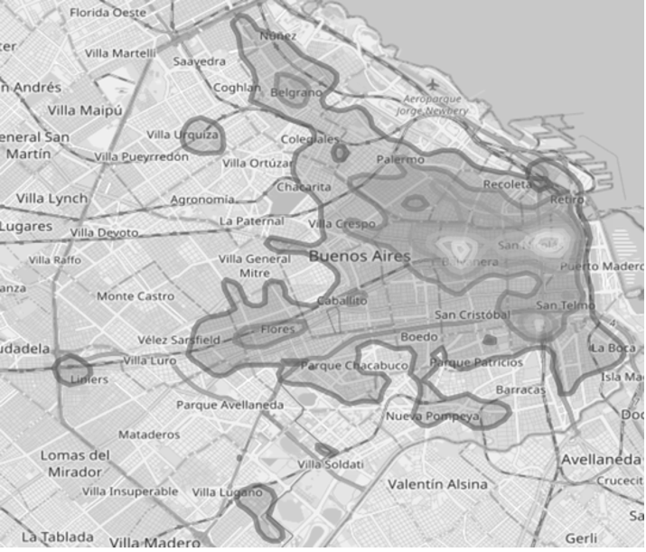
```

```{r, echo=FALSE, fig.align='center', out.width='70%', out.height='70%'}
library(rcrimeanalysis)
delitos %>% 
  dplyr::rename(latitude = lat, longitude = long) %>% 
  kde_map(pts = F)
```


  
---

# Transformación y limpieza de datos

🔸 Para efectos de este estudio se excluye el subtipo **"siniestro vial"**, debido a que tiene origen distinto al resto de los tipos de delitos.

🔸 El enfoque implementado tiene como objetivo la predicción de ocurrencia de delitos, **la clasificación de los tipos de delitos no se contempla**, por lo tanto los tipos de delitos como robo, hurto y homicidio se tratan como un crimen único.

<br>

--

```{r, echo=FALSE}
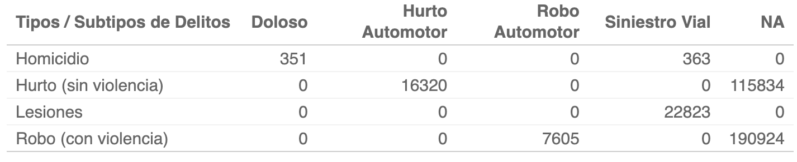
```

---

# Transformación y limpieza de datos

🔸 El punto de partida para el conteo de delitos por esquinas y la agregación de variables de entorno físico, reside en la **geolocalización obtenida de las esquinas de la ciudad**. Para ello se obtiene un objeto geoespacial con todas las calles y avenidas de CABA, las mismas se almacenan como polígonos. 

--

```{r, echo=FALSE,  out.width='55%', fig.align='center'}
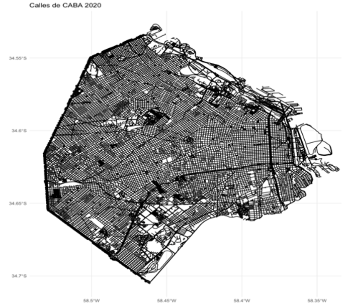
```

--

🔸 Los objetos geoespaciales se obtienen mediante el paquete **“osmdata”** 📦.

---

# Transformación y limpieza de datos

🔸 El siguiente paso consiste en realizar la intersección de estos polígonos, para obtener la geolocalización de las esquinas, se obtienen 22.048 esquinas.

--

```{r, echo=FALSE, out.width='55%', fig.align='center'}
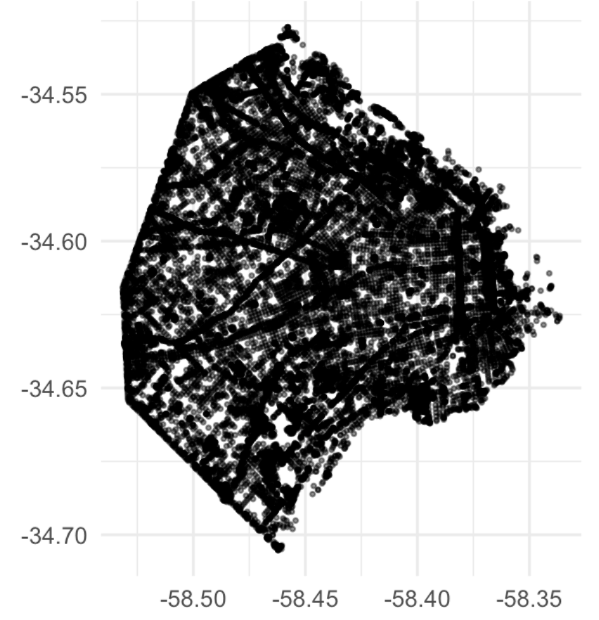
```

---

# Transformación y limpieza de datos

🔸 Se selecciona un número de esquinas óptimas a utilizar, para evitar contabilizar un delito de manera duplicada en distintas esquinas. **Son seleccionadas las esquinas que estén a una distancia de más de 200 metros entre sí**, para esto se utiliza un filtro de proximidad. 

--

🔸 Para estos cálculos geoespaciales, se utiliza el paquete **rangerBuilder** 📦, a continuación, se muestran las esquinas originales en conjunto con las esquinas óptimas filtradas, siendo en total 2.417 esquinas.

--

```{r, echo=FALSE ,out.width='70%', fig.align='center'}
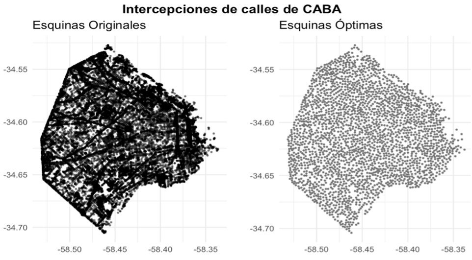
```

---

# Transformación y limpieza de datos

🔸 Se procede a calcular **el número de delitos ocurridos dentro de un radio de 150 metros** para cada esquina en cada uno de los meses analizados, se estudiaron un total de 231.514 delitos, de los cuales 182.346 tienen asociada una esquina.

--

```{r, echo=FALSE, out.width='70%', fig.align='center'}
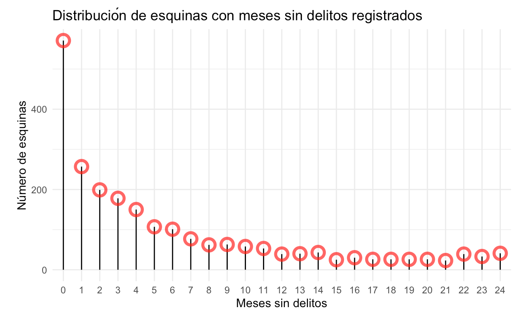
```

🔸 Las esquinas presentan 24 meses de observación, pero no en todos los meses registran delitos ocurridos, **se debe prestar atención aquellas esquinas con ocurrencia de delitos en pocos meses observados**.

---

# Transformación y limpieza de datos

Definidas las esquinas óptimas, se procede a calcular el número de elementos de entorno cercano dentro de un radio de 250 metros para cada esquina. 

--

## 🔸 Elementos de entorno  físico 🌎

Dentro de estos elementos se mencionan algunos como locales bailables, estaciones de metro, comisarías de policía, estaciones de servicio, embajadas, cines, entre otros. 

--

## 🔸 Elementos meteorológicos 🌦

Adicionalmente, se agregan los factores meteorológicos, siendo los mismos la temperatura promedio, mililitros de agua, lluvia y velocidad promedio del viento para cada mes.

---

# Transformación y limpieza de datos

🔸 Aplicación de la técnica de ventanas deslizantes, está consiste en seleccionar el mes intermedio **“t”** de todo el periodo de estudio, posteriormente se calcula el número de delitos ocurridos para cada esquina en **el mes anterior, en los últimos 3 meses, 6 meses, 12 meses y el mismo mes del año anterior**.

--

🔸 **La variable objetivo sería el número de delitos ocurridos en el mes de estudio**, además este mismo procedimiento es aplicado con las variables meteorológicas.

--

```{r, echo=FALSE,out.width='80%', fig.align='center'}
knitr::include_graphics('ventana_des.svg')
```

---

# Transformación y limpieza de datos

🔸 La función que realiza todos los cálculos de la técnica de ventana deslizante y el conjunto de datos definitivo fueron almacenados en el paquete **"sknifedatar"** 📦. 

--

#### sknifedatar 📦 puede instalarse mediante el lenguaje estadístico R a través de la siguiente sintaxis:

```{r, eval=FALSE}
install.packages('sknifedatar')
```

--

```{r, echo=FALSE, out.width='20%', out.height='20%', fig.align='center'}

```

Package ‘sknifedatar’ (2021) “Swiss Knife of Data” Rafael Zambrano [aut, cre], Karina Bartolomé [aut]. CRAN.R-project.org/package=sknifedatar
---
# Transformación y limpieza de datos

🔸 Este dataset cuenta con 69 columnas y 26.299 observaciones. **Cada observación hace referencia a una esquina vista desde un mes determinado**, las columnas agrupan las variables de entorno, clima y el historial de delitos ocurridos.

--

```{r ,eval=FALSE}
library(sknifedatar)

data_crime_clime %>% head()
```


```{r ,echo=FALSE}
library(sknifedatar)
data_crime_clime %>% 
  head() %>% 
  rmarkdown::paged_table(list(rows.print = 6))
```

---

# Estrategia de Modelado

🔸 La estrategia de validación se fundamenta en la siguiente estructura, siendo **“n”** el último mes de estudio, el mes de diciembre del año 2019 de cada esquina corresponde al conjunto de datos de validación. 

🔸 El resto de los meses para todas las esquinas constituyen los datos de entrenamiento, por lo tanto, se busca predecir lo ocurrido en el último mes de estudio en función de lo ocurrido en los meses anteriores.

<br>

--

```{r, echo=FALSE, fig.align='center'}
knitr::include_graphics('data_modelos.svg')
```

---
# Estrategia de Modelado

* **Enfoques de modelado** 🔎

🔸 Metodológicamente **se implementan dos enfoques de modelado** dependiendo del tipo de salida requerida, en este caso, de tipo continua para el conteo de delitos o discreta si se busca predecir el nivel de riesgo de las esquinas.

--

```{r, echo=FALSE, out.width='55%', fig.align='center'}
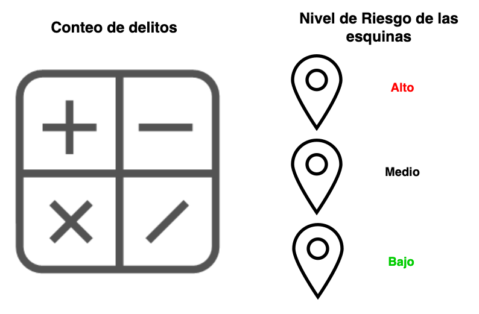
```

---
# Estrategia de Modelado / Enfoques de modelado

* **Conteo de Delitos** 📈

🔸 Para el conteo de delitos ocurridos, se desarrolla una primera aproximación estableciendo un modelo base, con esto se implementa un modelo poco complejo que establezca el límite inferior de rendimiento. 

--

🔸 Para esto, se aplica un modelo de series de tiempo, **que considerará únicamente la ocurrencia pasada de delitos en cada esquina**, haciendo el pronóstico para el mes de diciembre del año 2019. 

--

🔸 El objetivo es contrastar la siguiente hipótesis, un modelo de aprendizaje automático que considera el histórico de delitos ocurridos, el clima y el entorno de las esquinas, **debería poder superar el rendimiento de un modelo de serie de tiempo que solo considera el delito como variable**.


---
# Estrategia de Modelado / Enfoques de modelado

* **Nivel de Riesgo** 🚦

🔸 El segundo enfoque, corresponde a la aplicación de modelos de aprendizaje automático con el objetivo de predecir el nivel de riesgo de las esquinas.

🔸 **Previamente se discretiza la variable objetivo**, requiriendo con esto analizar la distribución de los delitos ocurridos.


--

## Modelo Multiclase 🚥

🔸 Se implementa un modelo de calcificación de múltiples clases, **siendo contrastado con la aplicación de dos modelos de clasificación binarios**. A continuación, se muestra en una tabla los umbrales seleccionados para discretizar la ocurrencia de delitos en niveles de riesgo para el enfoque multiclase.

--

```{r, echo=FALSE,  out.width='60%', fig.align='center'}
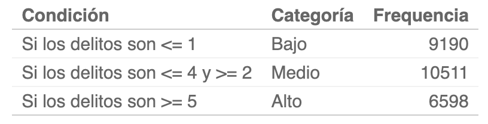
```

---
# Estrategia de Modelado / Enfoques de modelado

* **Evolución en el tiempo del nivel de riesgo de las esquinas** 📆

--

```{r, echo=FALSE, fig.align='center',out.height='10%', out.width='10%', eval=FALSE}
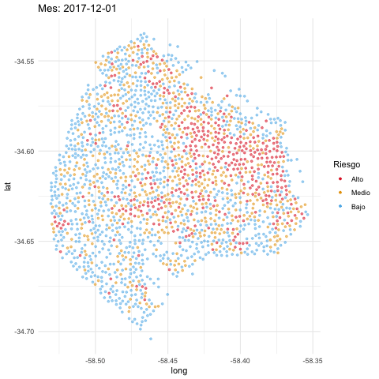
```


```{css, echo = FALSE}
img.animated-gif{
  width: 20px;
  height: 20px;
}
```


---
# Estrategia de Modelado / Enfoques de modelado

* **Nivel de Riesgo: Clasificadores Binarios** 🔴🔵

🔸 En la tabla anterior se agrupan las esquinas según el nivel de riesgo, distribuido en tres niveles, el objetivo reside en implementar modelos que puedan discriminar las tres categorías. 

🔸 Siguiendo este mismo procedimiento, se realiza la discretización en dos partes para implementar dos clasificadores binarios, **posteriormente se combinan las predicciones**. 

---
# Estrategia de Modelado / Enfoques de modelado

* **Nivel de Riesgo: Clasificadores Binarios**

🔸 Se generan las categorías “Alto” y “Medio_Bajo” para un primer clasificador, “Bajo” y “Medio_Alto” para un segundo clasificador. **Con esto se intenta capturar el orden jerárquico de las clases (Bajo < Medio < Alto)**, luego se unifican las predicciones de ambos modelos de forma tabular.

<br>

--

```{r, echo=FALSE, out.width='70%', fig.align='center'}
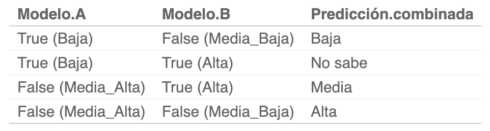
```

---

# Estrategia de Modelado 

🔸 Se aplica una validación cruzada de diez particiones utilizando la técnica “k-Fold-Cross-Validation (CV)”.

🔸 Adicionalmente los hiperparámetros de los modelos se ajustarán a través de una optimización bayesiana, con un máximo de 15 iteraciones y una restricción de finalización de 10 iteraciones sin mejora. 

🔸 Para el caso de los clasificadores binarios, se utiliza la técnica de **SMOTE**, igualando la clase minoritaria a igual proporción que la mayoritaria,  ya que se está comparando una categoría con dos categorías combinadas, produciendo un desbalance en los datos.

🔸 A excepción del enfoque de series de tiempo, todos los modelos se implementan en el marco de aprendizaje automático **Tidymodels**, perteneciente al lenguaje estadístico R.

--

* **Modelos de aprendizaje automático utilizados** 🤖

🔸  Para los modelos de aprendizaje automático, se implementaron dos modelos basados en árboles, siendo el **Extreme Gradient Boosting (XGB)** y el **Light Gradient Boosting Machine (LightGBM)**.

---

# Estrategia de Modelado 

* **Modelo de series de tiempo** 📉

🔸  Se utiliza el modelo **“Croton”**, siendo un modelo especial de regresiones de conteo para series intermitentes, que toma en cuenta únicamente el histórico de la ocurrencia de delitos. En la siguiente figura, se muestra el conteo histórico de delitos de una de las esquinas de CABA.

--

```{r, echo=FALSE, out.width='70%', fig.align='center'}
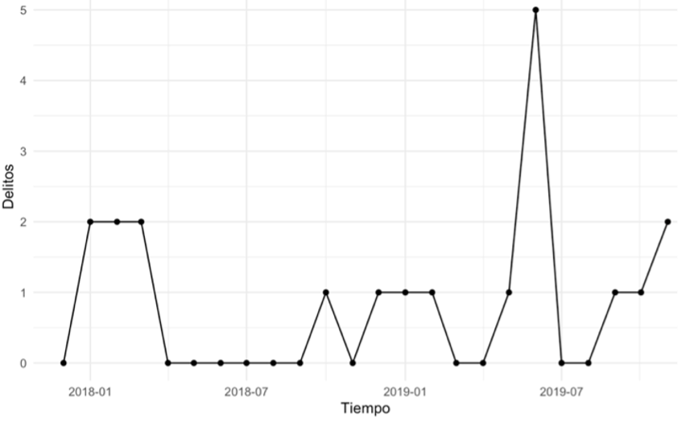
```

---

# Estrategia de Modelado 

* **Modelo de series de tiempo**

🔸 En la serie anterior se observan muchos ceros presentes en los datos, este tipo de series no suelen presentar una tendencia definida, además de ser bastante volátiles, **lo que dificulta realizar pronósticos con métodos convencionales**. 

🔸 Este modelo se ajusta para todas las esquinas, haciendo la predicción para el mes de validación, el ajuste se realiza con los parámetros por defecto, **finalmente se contrastará con el cálculo de la media de las series y el resto de los modelos**.

---
# Resultados

* **Evaluación de los modelos sobre el mes de validación (diciembre-2019)**

--

## 🔸 Predicción de delitos ocurridos

--

```{r, echo=FALSE, out.width='30%', fig.align='center'}
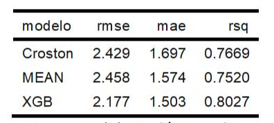
```

--

```{r, echo=FALSE,  out.width='70%', fig.align='center'}
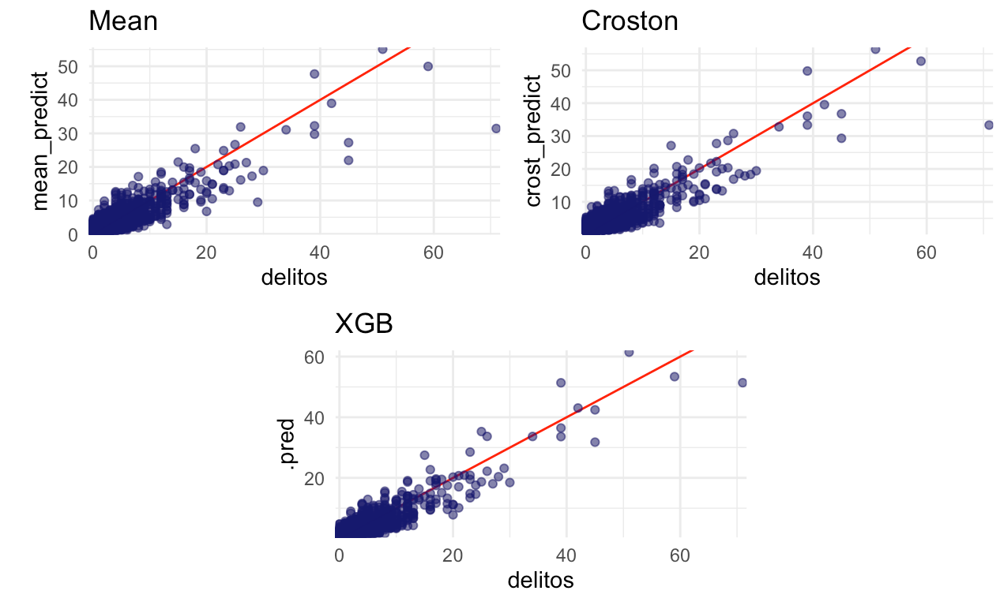
```

---
# Resultados

## 🔶 Predicción del nivel de riesgo

* **Multiclase**

--

```{r, echo=FALSE, out.width='80%', fig.align='center'}
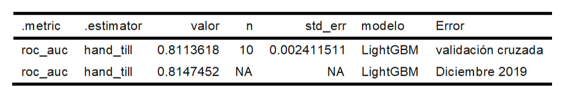
```

--

```{r, echo=FALSE,  out.width='60%', fig.align='center'}

```

---
# Resultados

🔸 **Clasificadores binarios**

--

```{r, echo=FALSE, out.width='80%', fig.align='center'}
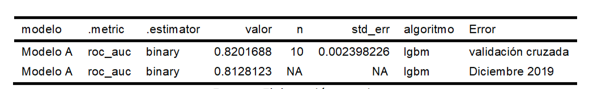
```

--

```{r, echo=FALSE, out.width='80%', fig.align='center'}
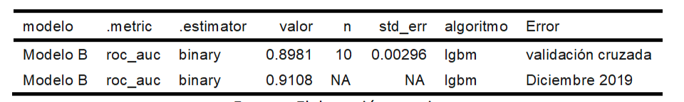
```

--

* **Matriz de confusión combinada**

--

```{r, echo=FALSE, out.width='50%', fig.align='center'}
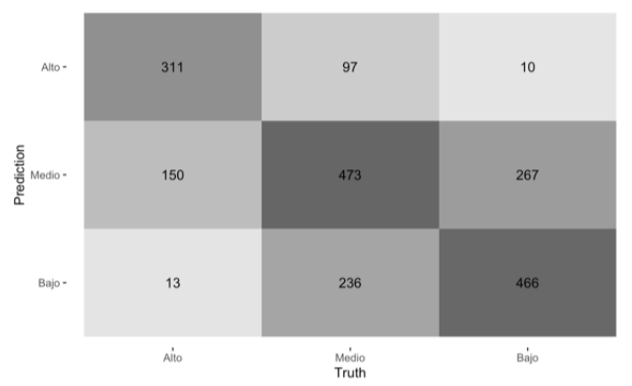
```

---
# Resultados

🔸 Aunque ambos enfoques presentan buenos rendimientos discriminando las categorías extremas, se propone asignar un mayor costo a este tipo de errores a través de una matriz de costos.

--

```{r, echo=FALSE, out.width='35%', fig.align='center'}
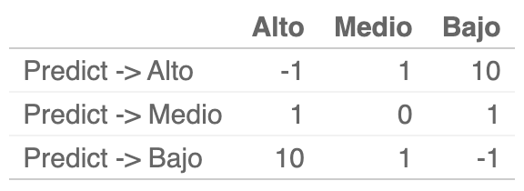
```

--

```{r, echo=FALSE, out.width='55%', fig.align='center'}
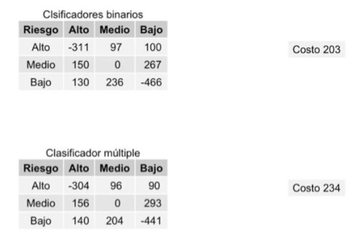
```

---
# Conclusiones

🔸 Se afirma que **es factible relacionar el factor “entorno-tiempo” con la ocurrencia de delitos**, mediante la implementación de modelos predictivos de aprendizaje automático, permitiendo generar una propuesta de valor para la aplicación de políticas de seguridad.

--

🔸 La incorporación de **los factores meteorológicos y de entorno físico, contribuyeron a generar mejores predicciones**, siendo evidente al observar el rendimiento inferior de los modelos que únicamente toman en cuenta el historial de delitos ocurridos. 

--

🔸 **Fue efectivo el planteamiento de enfocar la problemática desde distintas perspectivas**, específicamente desde los enfoques de predicción de ocurrencia de delitos y clasificación de niveles de riesgo, brindando un abanico más amplio de herramientas para apoyar la toma de decisiones por parte de la organización.

---

class: center, middle

# Muchas Gracias !!

Para consultar la versión extendida de este TFE:
[Predicción de delitos en CABA](https://rafael-zambrano-blog-ds.netlify.app/posts/2020-12-22-prediccin-de-delitos-en-caba/).

## Contacto ✉
Rafael Zambrano [](https://twitter.com/rafa_zamr) [](https://www.linkedin.com/in/rafael-zambrano/) [](https://github.com/rafzamb) [](https://rafael-zambrano-blog-ds.netlify.app/)

