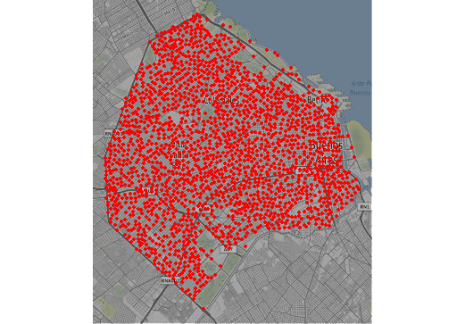

```{r setup, include=FALSE}
knitr::opts_chunk$set(warning = FALSE, 
                      message = FALSE, 
                      comment=FALSE)
```

```{r ,echo=FALSE}
library(tidyverse)
library(lubridate)
```


class: center

```{r xaringan-themer, include=FALSE, warning=FALSE, eval=FALSE}
library(xaringanthemer)
#style_mono_light(base_color = "#23395b")
#style_duo_accent(primary_color = "#FFFFFF", secondary_color = "#FA795E")
style_duo_accent(primary_color = "#FA795E",
                 secondary_color = "#FFFFFF",
                 header_h1_font_size = "1.8rem",
                 header_h2_font_size = "1.5rem",
                 header_h3_font_size = "1.0rem"
                 )
#style_duo_accent_inverse(primary_color = "#FFFFFF", secondary_color = "#FA795E")
#style_duo_accent_inverse(primary_color = "#FA795E", secondary_color = "#FFFFFF")
```


```{r, echo=FALSE}
knitr::include_graphics('fondo_fce.png')
```

<br>
<br>
<br>
<br>

 <font size="10"> MRG: Propuesta de Trabajo Final</font> 

<br>
<br>

#### 2021-10-19

#### Rafael Zambrano
---
class: center

```{r, echo=FALSE}
knitr::include_graphics('fondo_fce.png')
```

<br>
<br>
<br>

## Ocurrencia de delitos en las esquinas de CABA, casos registrados durante el periodo 2017-2019

<br>

#### Rafael Zambrano

---
# Resumen

🔸 El foco principal de este proyecto, reside en contextualizar la problemática de la criminalidad en la ciudad de Buenos Aires, con base en los casos registrados entre los años 2017 y 2019. Relacionando las esquinas de la ciudad con los elementos de entorno cercano a dichas intersección de calles.


---

# Problemática

🔸 La ocurrencia de delitos es un fenomeno de índole social y económico, dado lo amplio y transversal que resulta estudiar este tópico, se pretende abordar el tema mediante una relación funcional entre la problemática y los **"elementos de entorno"**. 

--

🔸 Se busca implementar modelos de regresión que permitan predecir la ocurrencia de delitos en un conjunto de esquinas de CABA, además, se pretende estimar la influencia de los elementos de entorno en la criminalidad.

--

🔸 ¿Cómo puede relacionarse el entorno geográfico y la ocurrencia delictiva, mediante un modelo de regresión de conetos?

<br>

---

# Conjunto de Datos

* **Fuente de datos**

🔸 Los datos brutos se extraen del repositorio del Gobierno de la Ciudad Autónoma de Buenos Aires (GCABA). [Repositorio del GCABA](https://data.buenosaires.gob.ar/dataset/).

--

* **Principales componentes de los datos**

🔸 Los datos tienen dos componentes fundamentales, el primero hace referencia a la geolocalización, siendo representado por la longitud y latitud en cada conjunto de datos. 

🔸 El segundo componente es el tiempo, que está presente en los delitos ocurridos y en los factores meteorológicos. 

---

# Distribución geográfica de los delitos registrados**

<br>

```{r, echo=FALSE,  out.width='50%', fig.align='center',eval=FALSE}
knitr::include_graphics('dist_delitos.png')
```

```{r, echo=FALSE, fig.align='center', out.width='70%', out.height='70%'}
library(rcrimeanalysis)

delitos <- readRDS("delitos.rds")

delitos %>% 
  dplyr::rename(latitude = lat, longitude = long) %>% 
  kde_map(pts = F)
```

---

# Conjunto de Datos

Son seleccionadas 2023 esquinas de CABA, indexando elementos de entono fisico y temporlaes para el mes de diciembre del año 2019.

--

## 🔸 Elementos de entorno  físico 🌎

Dentro de estos elementos se mencionan algunos como locales bailables, estaciones de metro, comisarías de policía, estaciones de servicio, embajadas, cines, entre otros. 

--

## 🔸 Elementos meteorológicos 🌦

Adicionalmente, se agregan los factores meteorológicos, siendo los mismos la temperatura promedio, mililitros de agua, lluvia y velocidad promedio del viento.

---

# Conjunto de Datos

🔸 El conjunto de datos fue almacenado en el paquete **"sknifedatar"** 📦. 

--

#### sknifedatar 📦 puede instalarse mediante el lenguaje estadístico R a través de la siguiente sintaxis:

```{r, eval=FALSE}
install.packages('sknifedatar')
```

--

```{r, echo=FALSE, out.width='20%', out.height='20%', fig.align='center'}

```

Package ‘sknifedatar’ (2021) “Swiss Knife of Data” Rafael Zambrano [aut, cre], Karina Bartolomé [aut]. CRAN.R-project.org/package=sknifedatar

---
# Transformación y limpieza de datos

🔸 Este dataset cuenta con 69 columnas y 2.023 observaciones, las columnas agrupan las variables de entorno, clima y el historial de delitos ocurridos.

--

```{r ,eval=FALSE}
library(sknifedatar)

data_crime_clime %>% head()
```


```{r ,echo=FALSE}
library(sknifedatar)

data <- sknifedatar::data_crime_clime %>% filter(pliegue == 13) %>% relocate(id, lat, long)

data %>% 
  head() %>% 
  rmarkdown::paged_table(list(rows.print = 6))
```

---
# Transformación y limpieza de datos


```{r, echo=FALSE}

```
